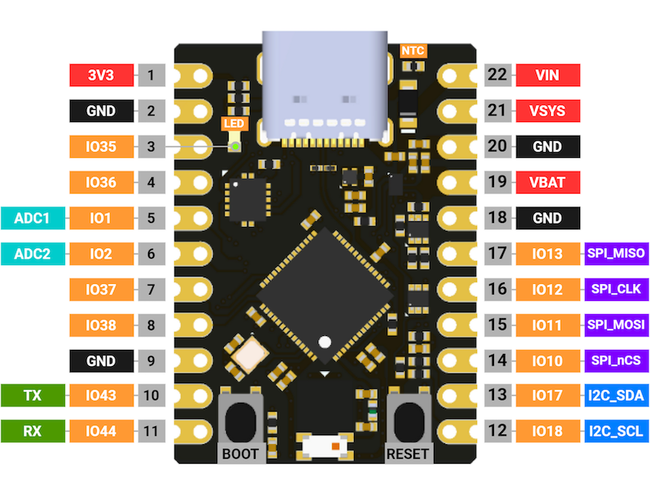

# Official libmcu development board

Boards produced by libmcu are divided into core boards and extension boards.

Several types of core boards are manufactured in the same form factor,
30x21.59mm long. Because data communication and debugger connection are
possible through the Type-C USB port of the core board, the core board by
itself can fully play the role of a development board.

Extention board is a board to which various sensors and functions are added.
A suitable core board can be attached/detached to the extension board.

Please refer to [getting started
guide](https://docs.libmcu.org/quickstart/index.html) to get started.

Schematics for boards can be found
[here](https://github.com/libmcu/development-board). And purchases can be made
[here](https://shop.libmcu.org).

## ESP32_libmcu
### Pinout

#### USB Type-C Connector

| Pin  | GND | TX1+ | TX1- | VBUS | CC1 | D+ | D- | SBU1 | VBUS | RX2- | RX2+ | GND |
| ---- | --- | ---- | ---- | ---- | --- | -- | -- | ---- | ---- | ---- | ---- | --- |
| Alt. |     | TDO  | TCLK |      |     |    |    |      |      | TDI  | TMS  |     |

### Specification

| Name                  | Desc.                                     |
| --------------------- | ----------------------------------------- |
| ESP32-S3FN8           | 240MHz dual core, 520KB SRAM, Wi-Fi, BLE5 |
| Flash                 | 8MB                                       |
| PSRAM                 | -                                         |
| Interface             | USB Type-C                                |
| LED                   | Green user light                          |
| Button                | Reset button, User button                 |
| PMU                   | BQ25180YBGR                               |
| Antenna               | 2.4GHz Chip antenna                       |
| Operating temperature | -30&deg; ~ 85&deg;C                       |
| Net Weight            |                                           |
| Gross Weight          |                                           |
| Product Size          | 30mm x 21.59mm                            |
| VIN Input Voltage     | 2.7 ~ 5.5VDC @ 1.1A                       |
| VSYS Output Voltage   | 4.4 ~ 4.9VDC @ 1.5A                       |
| VSYS Input Voltage    | 1.8 ~ 5.5VDC @ 1.1A                       |
| VBAT Voltage          | 2.2 ~ 4.6VDC @ 1.5A                       |

#### LED

- A user green LED
  - `IO0`
  - low active

#### Quiescent Current

- BQ25180
  - 4uA
- NCP167BMX330TBG
  - 12uA

#### Operating Temperature

| 파트명              | Min. | Max. | Unit   |
| ------------------- | ---- | ---- | ------ |
| TS5A2066YZPR        | -40  | 85   | &deg;C |
| BQ25180             | -40  | 125  | &deg;C |
| NCP167BMX330TBG     | -55  | 150  | &deg;C |
| KUSBX-SMT-CS2-B30TR | -30  | 85   | &deg;C |
| ESP32-S3FN8         | -40  | 85   | &deg;C |
| 2450AT18D0100E      | -40  | 125  | &deg;C |

## nRF52_libmcu
### Pinout

## STM32_libmcu
### Pinout

