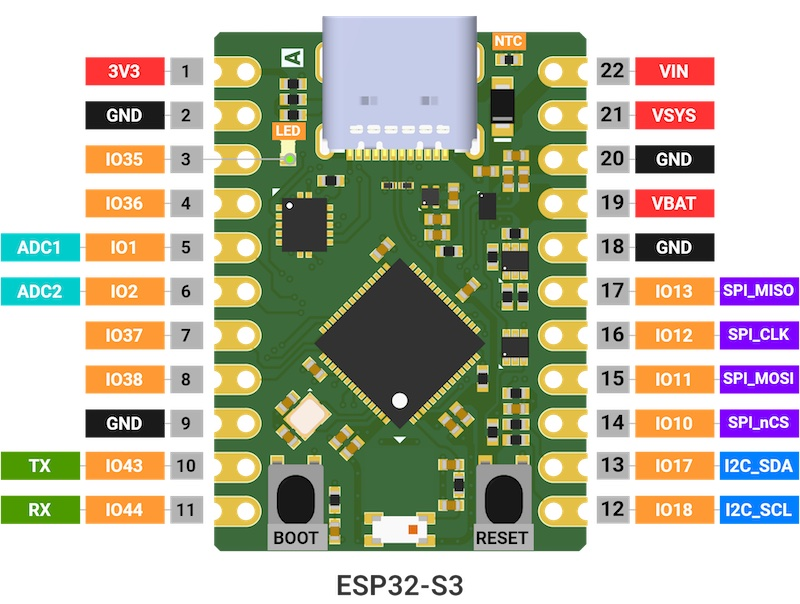
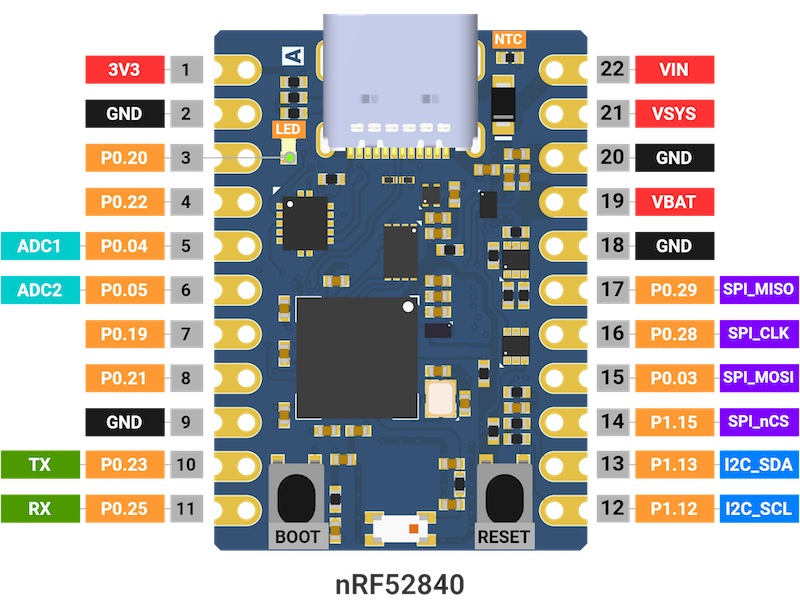
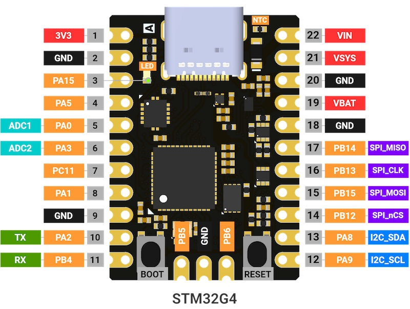

# MADI development board

Boards produced by libmcu are divided into core boards and extension boards.

Several types of core boards are manufactured in the same form factor,
30x21.59mm long. Because data communication and debugger connection are
possible through the Type-C USB port of the core board, the core board by
itself can fully play the role of a development board.

Extention board is a board to which various sensors and functions are added.
A suitable core board can be attached/detached to the extension board.

Please refer to [getting started
guide](https://docs.libmcu.org/quickstart/index.html) to get started.

Schematics for boards can be found
[here](https://github.com/libmcu/development-board). And purchases can be made
[here](https://libmcu.org/kr/madi/#td-block-9).

## Features
- 2 x 11 pin headers with edge castellations
- Serial Wire Debug(SWD) via USB C-type port
- TI’s advanced battery management IC, BQ25180, with fully supported driver
- Green LED indicator, User button and Reset button
- 4-layer PCB design for the better signal integrity and power integrity
- 700mA 3.3V LDO Regulator
- Low current consumption

## MADI ESP32
### Specification

| Name                  | Desc.                                                |
| --------------------- | ---------------------------------------------------- |
| ESP32-S3FN8           | XTensa LX7 240MHz dual core, 520KB SRAM, Wi-Fi, BLE5 |
| Flash                 | 8MB                                                  |
| PSRAM                 | -                                                    |
| Interface             | USB Type-C                                           |
| LED                   | Green user light                                     |
| Button                | Reset button, User button                            |
| Battery Charger       | BQ25180YBGR                                          |
| Antenna               | 2.4GHz Chip antenna                                  |
| Operating temperature | -30&deg; ~ 85&deg;C                                  |
| Product Size          | 30mm x 21.59mm                                       |
| VIN Input Voltage     | 4.4 ~ 5.5VDC @ 1.1A                                  |
| VSYS Output Voltage   | 4.4 ~ 4.9VDC @ 1.5A                                  |
| VSYS Input Voltage    | 1.8 ~ 5.5VDC @ 1.1A                                  |
| VBAT Voltage          | 3.5 ~ 4.6VDC @ 1.5A                                  |

### Pinout

### USB Type-C Connector

| Pin  | GND | TX1+ | TX1- | VBUS | CC1 | D+ | D- | SBU1 | VBUS | RX2- | RX2+ | GND |
| ---- | --- | ---- | ---- | ---- | --- | -- | -- | ---- | ---- | ---- | ---- | --- |
| Alt. |     | TDO  | TCLK |      |     |    |    |      |      | TDI  | TMS  |     |

### Pinmap internally connected

| Function    | ESP32-S3 |
| ----------- | -------- |
| GREEN LED   | IO35     |
| BQ25180 IRQ | IO14     |
| BQ25180 SDA | IO17     |
| BQ25180 SCL | IO18     |
| EN_VBAT_MON | IO4      |
| VBAT_MON    | IO7      |
| USER BUTTON | IO0      |

### Current Consumption

| Modem Sleep | Light Sleep | Deep Sleep |
| ----------- | ----------- | ---------- |
|      37.6mA |           - |     23.1uA |

#### Component Quiescent Current

| Part            | uA      |
| --------------- | ------- |
| BQ25180         |   3uA   |
| NCP167BMX330TBG |  12uA   |
| 74LVC4066BQ,115 |   0.1uA |

### Operating Temperature

| Part                | Min. | Max. | Unit   |
| ------------------- | ---- | ---- | ------ |
| 74LVC4066BQ,115     | -40  | 125  | &deg;C |
| BQ25180             | -40  | 125  | &deg;C |
| NCP167BMX330TBG     | -55  | 150  | &deg;C |
| ESP32-S3FN8         | -40  | 85   | &deg;C |
| 2450AT18D0100E      | -40  | 125  | &deg;C |
| KUSBX-SMT-CS2-B30TR | -30  | 85   | &deg;C |

## MADI nRF52
### Specification

| Name                  | Desc.                                     |
| --------------------- | ----------------------------------------- |
| NRF52840-QIAA-R7      | Cortex-M4F 64MHz, 256kB RAM, BLE5         |
| Flash                 | 1MB + 2MB SPI NOR Flash                   |
| Interface             | USB Type-C                                |
| LED                   | Green user light                          |
| Button                | Reset button, User button                 |
| Battery Charger       | BQ25180YBGR                               |
| Antenna               | 2.4GHz Chip antenna                       |
| Operating temperature | -30&deg; ~ 85&deg;C                       |
| Product Size          | 30mm x 21.59mm                            |
| VIN Input Voltage     | 4.4 ~ 5.5VDC @ 1.1A                       |
| VSYS Output Voltage   | 4.4 ~ 4.9VDC @ 1.5A                       |
| VSYS Input Voltage    | 1.8 ~ 5.5VDC @ 1.1A                       |
| VBAT Voltage          | 3.5 ~ 4.6VDC @ 1.5A                       |

### Pinout

### USB Type-C Connector

| Pin  | GND | TX1+ | TX1- | VBUS | CC1 | D+ | D- | SBU1 | VBUS | RX2- | RX2+ | GND |
| ---- | --- | ---- | ---- | ---- | --- | -- | -- | ---- | ---- | ---- | ---- | --- |
| Alt. |     | TDO  | TCLK |      |     |    |    |      |      | TDI  | TMS  |     |

### Pinmap internally connected

| Function    | nRF52840 |
| ----------- | -------- |
| GREEN LED   | P0.20    |
| BQ25180 IRQ | P0.26    |
| BQ25180 SDA | P1.13    |
| BQ25180 SCL | P1.12    |
| EN_VBAT_MON | P0.27    |
| VBAT_MON    | P0.31    |
| USER BUTTON | P1.07    |

### Current Consumption

| Run    | Sleep with System ON | Sleep with System OFF |
| ------ | -------------------- | --------------------- |
| 27.1mA |              17.55uA |                15.6uA |

#### Component Quiescent Current

| Part            | uA      |
| --------------- | ------- |
| BQ25180         |   3uA   |
| NCP167BMX330TBG |  12uA   |
| 74LVC4066BQ,115 |   0.1uA |
| MX25V1635F      |   9uA / 0.1uA(Deep power-down) |

### Operating Temperature

| 파트명              | Min. | Max. | Unit   |
| ------------------- | ---- | ---- | ------ |
| 74LVC4066BQ,115     | -40  | 125  | &deg;C |
| BQ25180             | -40  | 125  | &deg;C |
| NCP167BMX330TBG     | -55  | 150  | &deg;C |
| nRF52840-QIAA       | -40  | 85   | &deg;C |
| 2450AT18D0100E      | -40  | 125  | &deg;C |
| MX25V1635F          | -40  | 85   | &deg;C |
| KUSBX-SMT-CS2-B30TR | -30  | 85   | &deg;C |

## MADI STM32
### Specification

| Name                  | Desc.                                     |
| --------------------- | ----------------------------------------- |
| STM32G473CEU6         | Cortex-M4F 170MHz, 128kB RAM              |
| Flash                 | 512KB + 2MB SPI NOR Flash                 |
| Interface             | USB Type-C                                |
| LED                   | Green user light                          |
| Button                | Reset button, User button                 |
| Battery Charger       | BQ25180YBGR                               |
| Antenna               | 2.4GHz Chip antenna                       |
| Operating temperature | -30&deg; ~ 85&deg;C                       |
| Net Weight            |                                           |
| Gross Weight          |                                           |
| Product Size          | 30mm x 21.59mm                            |
| VIN Input Voltage     | 4.4 ~ 5.5VDC @ 1.1A                       |
| VSYS Output Voltage   | 4.4 ~ 4.9VDC @ 1.5A                       |
| VSYS Input Voltage    | 1.8 ~ 5.5VDC @ 1.1A                       |
| VBAT Voltage          | 3.5 ~ 4.6VDC @ 1.5A                       |

### Pinout

### USB Type-C Connector

| Pin  | GND | TX1+ | TX1- | VBUS | CC1 | D+ | D- | SBU1 | VBUS | RX2- | RX2+ | GND |
| ---- | --- | ---- | ---- | ---- | --- | -- | -- | ---- | ---- | ---- | ---- | --- |
| Alt. |     | TDO  | TCLK |      |     |    |    |      |      | TDI  | TMS  |     |

### Pinmap internally connected

| Function    | STM32G4 |
| ----------- | ------- |
| GREEN LED   | PA.15   |
| BQ25180 IRQ | PC.6    |
| BQ25180 SDA | PA.8    |
| BQ25180 SCL | PA.9    |
| EN_VBAT_MON | PB.2    |
| VBAT_MON    | PC.4    |
| USER BUTTON | PB.8    |

### Current Consumption

| Run    | Sleep | Stop   | Standby |
| ------ | ----- | ------ | ------- |
| 27.1mA | 8.1mA | 96.7uA | 15.38uA |

#### Component Quiescent Current

| Part            | uA      |
| --------------- | ------- |
| BQ25180         |   3uA   |
| NCP167BMX330TBG |  12uA   |
| 74LVC4066BQ,115 |   0.1uA |
| MX25V1635F      |   9uA / 0.1uA(Deep power-down) |

### Operating Temperature

| 파트명              | Min. | Max. | Unit   |
| ------------------- | ---- | ---- | ------ |
| 74LVC4066BQ,115     | -40  | 125  | &deg;C |
| BQ25180             | -40  | 125  | &deg;C |
| NCP167BMX330TBG     | -55  | 150  | &deg;C |
| ESP32-S3FN8         | -40  | 85   | &deg;C |
| 2450AT18D0100E      | -40  | 125  | &deg;C |
| STM32G473CEU6       | -40  | 85   | &deg;C |
| KUSBX-SMT-CS2-B30TR | -30  | 85   | &deg;C |

