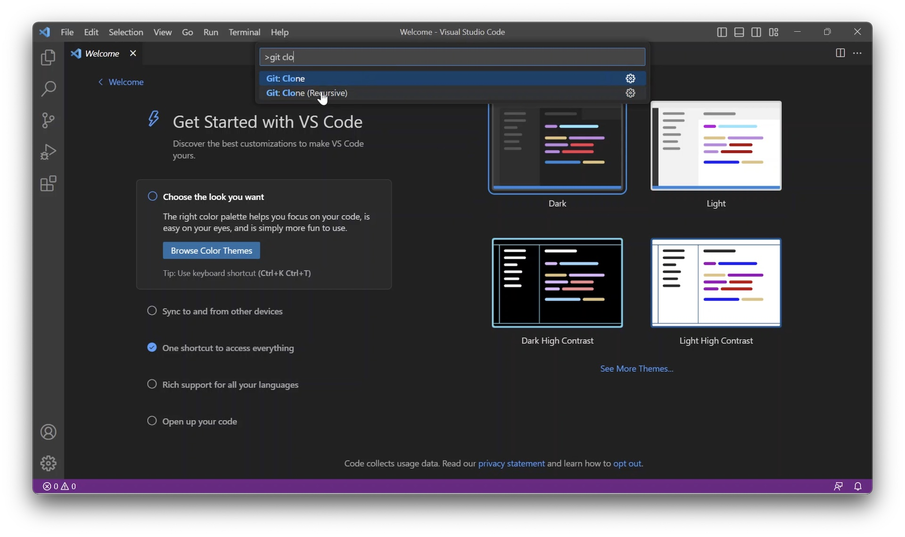
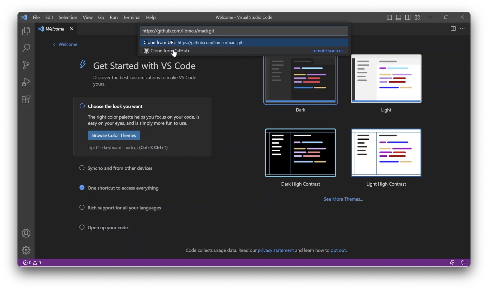
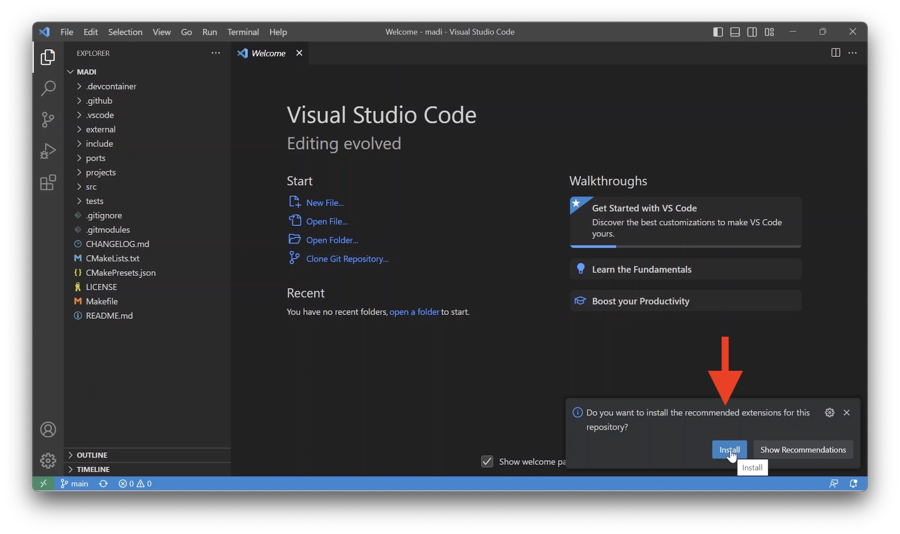
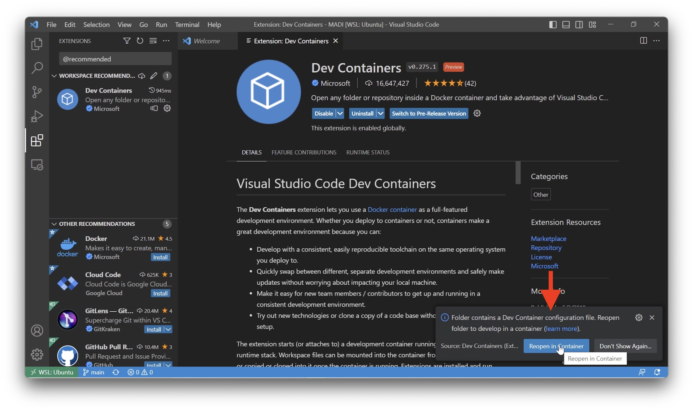
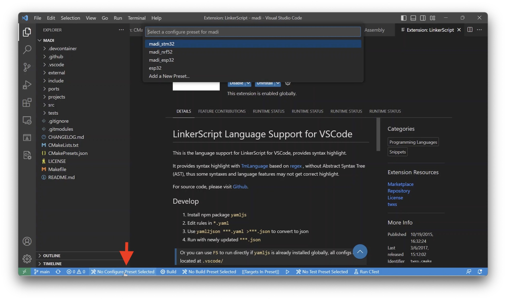
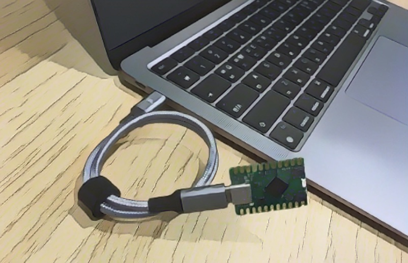
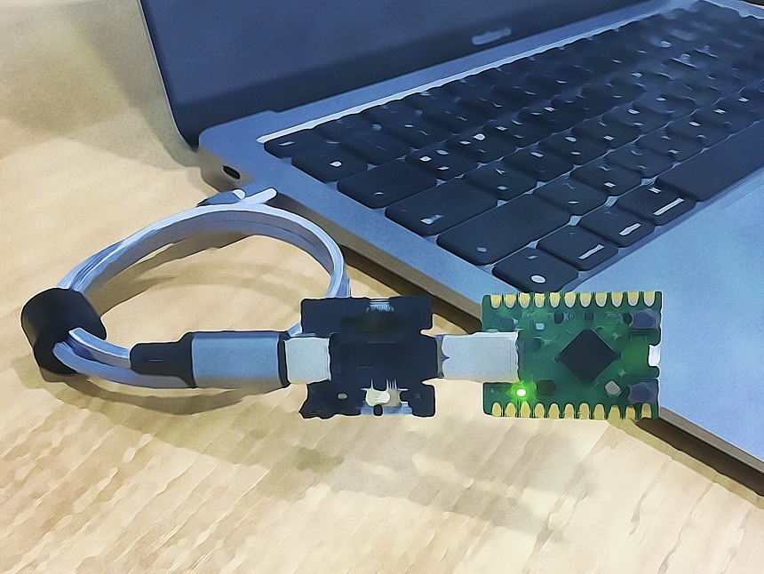

Getting Started
===============

개발 환경 설정하기
------------------

도커Docker가 네이티브로 실행되는 리눅스 환경에서는 도커 기반 환경을 권장합니다.
맥과 윈도우즈 환경에서는 도커에서의 느린 빌드 속도 때문에 다른 대안을
안내합니다.

윈도우즈에서는 WSL2 또는 MSYS2를 사용하는 두가지 방법이 있습니다. WSL2의 이점이
분명히 보이지만, 디바이스 마운트하는 과정이 번거롭기 때문에 여기서는 MSYS2로
안내합니다.

.. tip::
   빌드 속도가 중요하지 않거나, 일회적 경험을 위해서라면 운영체제에 상관없이
   도커 사용을 추천합니다. 바로 `프로젝트 빌드하기`_ 섹션으로 진행하세요.

.. note::
   In case you go with `Zephyr <https://zephyrproject.org/>`__, use `west`
   which is Zephyr's meta tool. Please refer to `Zephyr's Getting Started Guide
   <https://docs.zephyrproject.org/latest/develop/getting_started/index.html>`__.

   Zephyr kernel configurations and devicetree overlays for a board can be
   found at each board page below: `Board Configuration`_.

.. tabs::
   .. tab:: 맥
      1. ARM GNU 툴체인을 설치합니다: `애플 실리콘일 경우 <https://developer.arm.com/-/media/Files/downloads/gnu/12.2.rel1/binrel/arm-gnu-toolchain-12.2.rel1-darwin-arm64-arm-none-eabi.pkg>`_ 또는 `인텔 맥인 경우 <https://developer.arm.com/-/media/Files/downloads/gnu/12.2.rel1/binrel/arm-gnu-toolchain-12.2.rel1-darwin-x86_64-arm-none-eabi.pkg>`_
      2. `VSCode <https://code.visualstudio.com/>`_ 를 설치합니다
      3. `ESP-IDF extension <https://marketplace.visualstudio.com/items?itemName=espressif.esp-idf-extension>`_ 을 설치합니다
   .. tab:: 리눅스
      1. `Docker <https://www.docker.com/>`_ 를 설치합니다
      2. `VSCode <https://code.visualstudio.com/>`_ 를 설치합니다
   .. tab:: 윈도우즈
      1. `Git <https://git-scm.com/downloads>`_ 을 설치합니다
      2. `MSYS2 <https://www.msys2.org>`_ 를 설치합니다
      3. 필요한 툴을 설치합니다: `pacman -Syu && pacman -S mingw-w64-x86_64-make mingw-w64-x86_64-cmake mingw-w64-x86_64-arm-none-eabi-toolchain ninja mingw-w64-x86_64-dfu-util`
      4. 윈도우즈 환경변수 PATH에 다음을 추가합니다: C:\\msys64\\mingw64\\bin, C:\\msys64\\usr\\bin
      5. `VSCode <https://code.visualstudio.com/>`_ 를 설치합니다

      `영상 가이드 <https://youtu.be/pbw4R4dBoak>`_ 를 참고하세요.

프로젝트 빌드하기
-----------------

1. | 프로젝트 저장소를 클론합니다: https://github.com/libmcu/madi.git
   | 마디 SDK 는 내부적으로 서브모듈을 사용하고 있기 때문에 클론할 때 Recursive 를 선택해주세요.

.. tip:: VSCode 에서 Ctrl+Shift+P 또는 Cmd+Shift+P(맥) 를 누르면 커맨드 팔레트가 뜹니다.

2. 클론이 완료된 뒤 창 우측하단에 확장 프로그램 설치 팝업이 뜨면 설치를 진행합니다.

3. | 도커를 사용한다면 아래 스크린샷처럼 "Reopen in Container" 버튼을 클릭합니다.
   | 도커를 사용하지 않는 경우 무시합니다.

4. | 프로젝트 로딩이 완료되면 최하단 툴바에 CMake 관련 메뉴들이 생성됩니다.
   | Preset 설정 버튼을 눌러 타겟보드를 지정하고, 그 오른쪽에 있는 타겟 버튼을 눌러 빌드 타겟을 선택합니다.
   | 그리고 Preset 설정 버튼 오른쪽에 있는 Build 버튼을 누르면 빌드가 시작됩니다.

.. image:: vscode_target.jpg

보드 연결하기
-------------

아래 이미지처럼 USB Type-C 케이블로 마디보드와 컴퓨터를 연결합니다.

확장 커넥터 또는 디버거를 사용할 경우 아래 이미지처럼 연결합니다.

Board Configuration
-------------------

.. toctree::
   :maxdepth: 2

   at32
   esp32
   nrf52
   stm32
